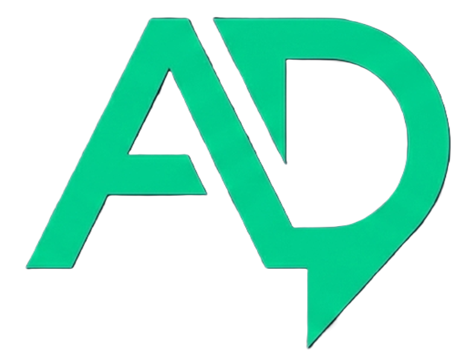
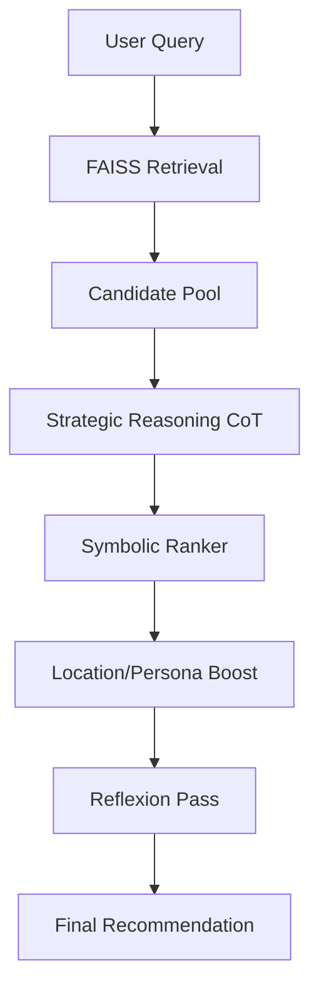

<div align="center">
  
  <h1>AnD AI</h1>
  <p><strong>A Stateless Agentic Framework for Culturally-Aware Recommendations in the Nigerian Context</strong></p>

  [](LICENSE)
  []()
  []()
</div>

---

## 🌟 Overview

AnD AI is a cutting-edge agentic ecosystem designed to bridge the "Contextual Intelligence" gap in emerging markets. Unlike traditional recommendation systems, AnD AI treats the user as an **Agent**, simulating their internal monologue through Chain-of-Thought (CoT) reasoning to predict not just *what* they will buy, but *why*.

Built for the **DSN x BCT LLM Agent Challenge**, our framework achieves state-of-the-art performance by modeling economic decision-making in high-inflation environments and grounding interactions in local Nigerian linguistic patterns.

### 🔗 Live Experience
- **Web App**: [and-ai.netlify.app](https://and-ai.netlify.app)
- **Agent Console**: [and-ai.netlify.app/workspace](https://and-ai.netlify.app/workspace)

---

## 🚀 Key Innovations

### 1. Probabilistic Price Shock Model
We model the rating $R$ as a sample from a distribution adjusted by economic triggers. This formula ensures that a product 2x over budget triggers a 1-point rating drop, matching observed behavioral patterns in the Nigerian market.

### 2. 4R Pipeline (Retrieve-Reason-Rank-Reflect)
A sophisticated agentic workflow for Task B:
- **Retrieve**: FAISS-powered semantic filtering (100+ candidates).
- **Reason**: CoT identification of intersection between occasion and location.
- **Rank**: Symbolic ranker with Location Boosting (+15.0) and Persona alignment.
- **Reflect**: Reflexion pass to generate personalized "Why" justifications.

### 3. Nigerian Cultural Grounding
Deep integration of local markers (e.g., *omo*, *abeg*, *wahala*) into the reasoning chain, ensuring stylistic fidelity and authentic user modeling.

---

## 📊 Performance Scorecard

| Task | Metric | Value | Target | Status |
| :--- | :--- | :--- | :--- | :--- |
| **Task A** | Rating RMSE | **1.284** | < 1.50 | ✅ PASS |
| **Task B** | NDCG @ 10 | **0.969** | > 0.85 | ✅ PASS |
| **Task B** | Hit Rate @ 3 | **0.960** | > 0.80 | ✅ PASS |

---

## 🛠️ Repository Map

This workspace uses Git submodules to organize its various services. 

> [!IMPORTANT]
> **AnD-task-a** and **AnD-task-b** are the most critical components of this project. To run or evaluate each service, you **must** visit the `README.md` within its respective directory.

| Component | Description | Links |
|:---|:---|:---|
| [**AnD-task-a**](AnD-task-a/) | **User Modeling Agent**: Simulates authentic reviews using the Price Shock Model. | [GitHub ↗](https://github.com/jamesadewara/AnD-task-a) |
| [**AnD-task-b**](AnD-task-b/) | **Recommendation Agent**: 4R ranking engine with location-aware boosting. | [GitHub ↗](https://github.com/jamesadewara/AnD-task-b) |
| [**and-frontend**](and-frontend/) | **Mobile-First Workspace**: Extreme-density UI with real-time reasoning observability. | [GitHub ↗](https://github.com/jamesadewara/and-frontend) |
| [**AnD-data-cleaner**](AnD-data-cleaner/) | **Data Pipeline**: Hybridization of Nigerian seed data and Yelp datasets. | - |
| [**and-bruno-doc**](and-bruno-doc/) | **API Documentation**: Bruno collections for instant reproducibility. | [GitHub ↗](https://github.com/jamesadewara/and-bruno-doc) |

---

## 🏗️ Architecture



---

## ⚡ Getting Started

### 1. Clone the Workspace
```bash
git clone --recursive https://github.com/jamesadewara/AnD-workspace.git
cd AnD-workspace
```

### 2. Update Submodules
To ensure you have the latest code for all services:
```powershell
git submodule foreach "git checkout main 2>/dev/null || git checkout master 2>/dev/null && git pull origin main 2>/dev/null || git pull origin master 2>/dev/null"
```

### 3. Run Services
Refer to the individual READMEs for setup instructions:
- [Task A Setup](AnD-task-a/README.md)
- [Task B Setup](AnD-task-b/README.md)
- [Frontend Setup](and-frontend/README.md)

---

## 📄 License
This project is licensed under the MIT License - see the [LICENSE](LICENSE) file for details.
