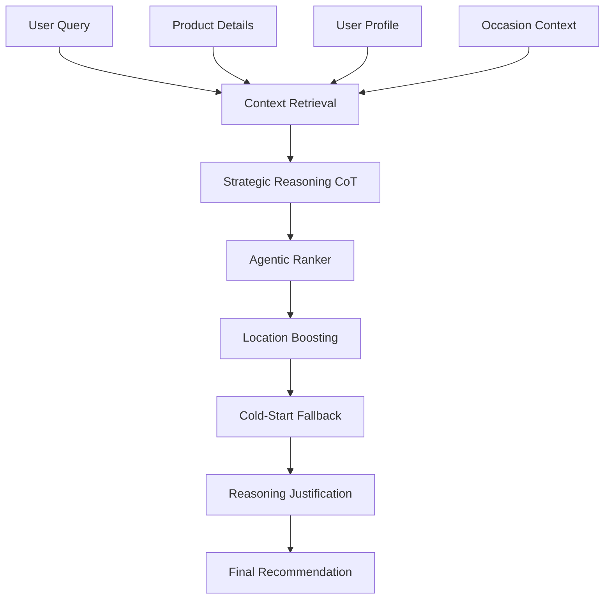

<div align="center">
  
  <h1>AnD AI</h1>
  <p><strong>A Stateless Agentic Framework for Culturally-Aware Recommendations in the Nigerian Context</strong></p>

  [](LICENSE)
  []()
  []()
</div>

---

## 🌟 Overview

AnD AI is a cutting-edge agentic ecosystem designed to bridge the "Contextual Intelligence" gap in emerging markets. Unlike traditional recommendation systems, AnD AI treats the user as an **Agent**, simulating their internal monologue through Chain-of-Thought (CoT) reasoning to predict not just *what* they will buy, but *why*.

Built for the **DSN x BCT LLM Agent Challenge**, our framework achieves state-of-the-art performance by modeling economic decision-making in high-inflation environments and grounding interactions in local Nigerian linguistic patterns.

### 🔗 Live Experience
- **Web App**: [and-ai.netlify.app](https://and-ai.netlify.app)
- **Agent Console**: [and-ai.netlify.app/workspace](https://and-ai.netlify.app/workspace)
- And-Task-A: Backend https://jamestron-and-task-a.hf.space/redoc
- AnD-Task-B Backend: https://jamestron-and-task-b.hf.space/redoc

---

## 🚀 Key Innovations

### 1. Probabilistic Price Shock Model
We model the rating $R$ as a sample from a distribution adjusted by economic triggers. This formula ensures that a product 2x over budget triggers a 1-point rating drop, matching observed behavioral patterns in the Nigerian market.

### 2. 6-Step Agentic Pipeline (Retrieve-Reason-Rank-Validate)
A sophisticated reasoning workflow for Task B:
- **Retrieve**: Context gathering from input details and historical data.
- **Reason**: Chain-of-Thought identification of user occasion and location intersection.
- **Rank**: Strategic scoring with Location Boosting (+15.0) for exact city matches and Persona alignment.
- **Validate**: Quality assurance of recommendations against context.
- **Fallback**: Cold-start demographic inference for users with zero history.
- **Reflect**: Generation of personalized reasoning explanations.

### 3. Nigerian Cultural Grounding
Deep integration of local markers (e.g., *omo*, *abeg*, *wahala*) into the reasoning chain, ensuring stylistic fidelity and authentic user modeling.

---

## 📊 Performance Scorecard

| Task | Metric | Value | Target | Status |
| :--- | :--- | :--- | :--- | :--- |
| **Task A** | Rating RMSE | **1.284** | < 1.50 | ✅ PASS |
| **Task B** | NDCG @ 10 | **0.969** | > 0.85 | ✅ PASS |
| **Task B** | Hit Rate @ 3 | **0.960** | > 0.80 | ✅ PASS |

---

## 🛠️ Repository Map

This workspace uses Git submodules to organize its various services. 

> [!IMPORTANT]
> **AnD-task-a** and **AnD-task-b** are the most critical components of this project. To run or evaluate each service, you **must** visit the `README.md` within its respective directory.

| Component | Description | Links |
|:---|:---|:---|
| [**AnD-task-a**](AnD-task-a/) | **Review Generation Engine**: 5-step workflow (Retrieve → Analyze → Reason → Generate → Reflect) for generating authentic Nigerian product reviews with probabilistic rating model. Multi-model failover via OpenRouter. | [GitHub ↗](https://github.com/jamesadewara/AnD-task-a) |
| [**AnD-task-b**](AnD-task-b/) | **Recommendation Engine**: 6-step agentic ranking with location-aware boosting (+15.0 for exact city matches), occasion-awareness, and cold-start logic. Stateless design with visible reasoning chains. | [GitHub ↗](https://github.com/jamesadewara/AnD-task-b) |
| [**and-frontend**](and-frontend/) | **Command-Center UI**: Mobile-optimized Next.js workspace with real-time Agent Console for Chain-of-Thought observability, model failover visualization, live SSE heartbeats, and pre-submission payload validation. | [GitHub ↗](https://github.com/jamesadewara/and-frontend) |
| [**AnD-data-cleaner**](AnD-data-cleaner/) | **Data Processing Scripts**: Python utilities for validating and transforming Yelp dataset samples (from Kaggle) into task-specific formats for local development and testing. | - |
| [**and-bruno-doc**](and-bruno-doc/) | **API Collections**: Bruno REST client collections for instant endpoint testing and reproducibility without manual cURL commands. Pre-configured for localhost and production URLs. | [GitHub ↗](https://github.com/jamesadewara/and-bruno-doc) |

---

## 🏗️ Architecture



---

## 📋 Prerequisites

- **Git**: For cloning and managing submodules
- **Docker** & **Docker Compose**: For containerized service deployment
- **Node.js 18+**: For frontend development (`pnpm` recommended)
- **Python 3.9+**: For backend services and data processing scripts
- **OpenRouter API Key**: Required for LLM access across all services

---

## ⚡ Quick Start

### 1. Clone the Workspace
```bash
git clone --recursive https://github.com/jamesadewara/AnD-workspace.git
cd AnD-workspace
```

If you already cloned without `--recursive`:
```bash
git submodule update --init --recursive
```

### 2. Update All Submodules to Latest
Ensure every component is on the latest `main` branch:
```powershell
git submodule foreach "git checkout main 2>/dev/null || git checkout master 2>/dev/null && git pull origin main 2>/dev/null || git pull origin master 2>/dev/null && git --no-pager log --oneline -1"
```

### 3. Set Up Environment Variables
Create `.env` files in each service directory. See individual README files:
- [Task A Env Setup](AnD-task-a/README.md#1-environment-setup)
- [Task B Env Setup](AnD-task-b/README.md#1-environment-setup)
- [Frontend Env Setup](and-frontend/README.md#2-configure-environment)

All services require `OPENROUTER_API_KEY`.

### 4. Run Services

**Option A: Docker Compose (Recommended)**
```bash
docker compose up --build
```
This starts:
- Task A API on `http://localhost:8000`
- Task B API on `http://localhost:8001`
- Frontend on `http://localhost:3000`

**Option B: Individual Services**

Refer to individual service READMEs:
- [Task A Setup](AnD-task-a/README.md)
- [Task B Setup](AnD-task-b/README.md)
- [Frontend Setup](and-frontend/README.md)

---

## 🧪 Testing & Validation

### API Testing
Use the Bruno collections in [and-bruno-doc](and-bruno-doc/) for quick endpoint testing:
1. Import the workspace into Bruno
2. Update the API URLs if running locally
3. Test Task A review generation and Task B recommendations

### Local Development
- **Frontend**: `cd and-frontend && pnpm dev` → `http://localhost:3000`
- **Task A**: `cd AnD-task-a && docker build -t and-task-a . && docker run -p 8000:8000 --env-file .env and-task-a`
- **Task B**: `cd AnD-task-b && docker build -t and-task-b . && docker run -p 8001:8001 --env-file .env and-task-b`

---

## 🔍 Design Principles

✅ **Stateless**: No persistent databases or session storage  
✅ **Transparent**: Every reasoning step exposed via UI console  
✅ **Resilient**: Multi-model failover (GLM-4.5 → Nemotron-3 → Gemma-4)  
✅ **Nigerian-Centric**: Deep cultural grounding in language, locations, and user archetypes  
✅ **Mobile-First**: Optimized for budget Android devices common in Nigeria  
✅ **Compliant**: Zero external datasets, pure agentic reasoning

---

## 📄 License
This project is licensed under the MIT License - see the [LICENSE](LICENSE) file for details.
